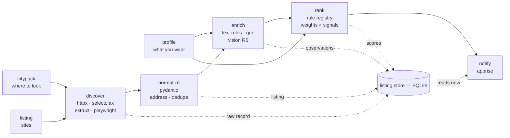
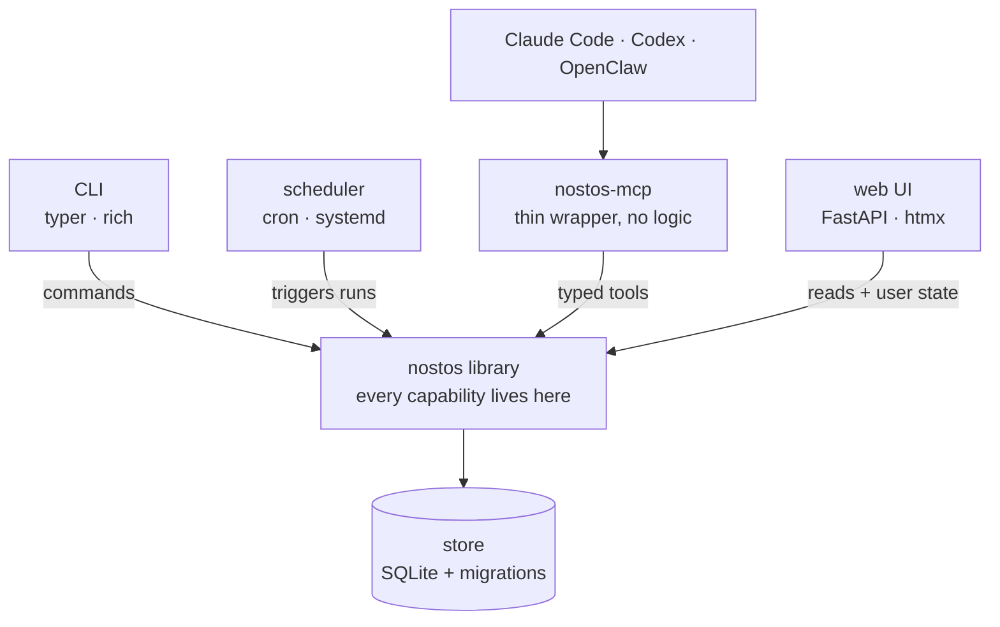

# 02 · Architecture

## Principles

Four rules. They decide every argument not otherwise settled.

1. **One record, many observations.** Every fact about a listing carries where it came
   from. Provenance is not metadata bolted on — it is how conflicts resolve and why a
   ranking can be explained.
2. **The pipeline is deterministic.** A scheduled run produces the same output from the
   same inputs. Models operate at the edges — perception in, authoring out — never in
   the spine.
3. **All capability lives in the library.** CLI, MCP server, web UI and scheduler are
   callers. None may do something the library cannot.
4. **Nothing paid runs without consent.** Estimate, ask, cap. The free path is default.

## How a run works



Every stage reads and writes the same store, so any stage can re-run alone. Change your
weights and only `rank` runs again. Fix a parser and only `normalize` replays.

The profile also selects which sources are enabled — an edge omitted above for clarity.

## Surfaces



All three agent hosts speak MCP, so one server reaches every one of them.

**The constraint that keeps this one product:** `nostos-mcp` exposes library calls as
typed tools and holds no behaviour of its own. The moment it can do something the CLI
cannot, the non-agent user gets the worse product.

## Where models are allowed

| Role | Where | Rule |
|---|---|---|
| **Runtime perception** | Photo understanding (R5); text extraction as a fallback *after* deterministic parsers miss | Optional, cached by content hash, budgeted, lowest confidence tier. System must work fully with it off. |
| **Authoring** | Drafting adapters and citypacks from fixtures (R4); repairing parsers after a site redesign | Output is reviewed code in a PR. Non-determinism is spent once, at authoring time. |
| **Building** | Humans and coding agents writing this repo | Not part of the architecture. Cross-agent flexibility comes from the repo being conventional. |
| **Never** | Orchestrating or routing the scheduled run | A ranking that changed because the model felt different is one you cannot reproduce or explain. |

## Package layout

Bracketed markers show the release a module first appears in.

```
nostos/
├── pyproject.toml
├── src/nostos/
│   ├── cli.py                    typer entrypoint: init, watch, rank, browse, city
│   ├── context.py                SearchContext = citypack + profile, threaded everywhere
│   ├── config/
│   │   ├── citypack.py           pydantic models + loader + validator
│   │   ├── profile.py            hard filters, weights, proximity, sinks
│   │   └── wizard.py             plain-language questions → weights
│   ├── model/
│   │   ├── listing.py            Listing, Field, Observed, Absence
│   │   ├── value.py              Money, Area, Place, Photo, LatLng
│   │   ├── source_record.py      raw payload envelope
│   │   └── identity.py           ListingId, Signature
│   ├── store/
│   │   ├── db.py                 connection, pragmas, WAL
│   │   ├── migrations/           0001_initial.sql, numbered, forward-only
│   │   └── repo.py               ListingRepo, ObservationRepo, ScoreRepo, RunRepo
│   ├── sources/
│   │   ├── base.py               Source protocol, Capabilities
│   │   ├── registry.py           discovery + enable/disable resolution
│   │   ├── craigslist.py         HTML + RSS prefilter
│   │   ├── kijiji.py             JSON-LD ItemList
│   │   ├── credentials.py        keyring-backed, never in config        [R4]
│   │   ├── probe.py              coverage probe: blocked vs empty       [R4]
│   │   └── contrib/              credentialed, opt-in extra             [R4]
│   ├── normalize/
│   │   ├── normalizer.py         SourceRecord → Listing, pure
│   │   ├── address.py            PORTED — 52 tests
│   │   └── dedupe.py             PORTED —  5 tests
│   ├── enrich/
│   │   ├── base.py               Enricher protocol: provides/requires/cost
│   │   ├── chain.py              topological order, skip-if-known
│   │   ├── text.py               PORTED detectors — laundry, den, floor
│   │   ├── budget.py             estimate → confirm → cap
│   │   ├── geo.py                ORS + Nominatim                        [R3]
│   │   └── photo.py              vision provider protocol               [R5]
│   ├── rank/
│   │   ├── rules.py              @rule registry, detectors (PORTED)
│   │   ├── engine.py             weights × signals, normalized to your max
│   │   └── explain.py            breakdown → human-readable
│   ├── watch/
│   │   ├── runner.py             orchestrates one run, concurrent per source
│   │   ├── notify.py             apprise sink
│   │   └── health.py             per-source baselines, load_bearing
│   ├── ui/                       FastAPI + htmx, no build step          [R2]
│   └── mcp/server.py             thin tool wrapper                      [R1/R2]
├── citypacks/vancouver.yaml
├── profiles/balanced.yaml · example-vancouver.yaml
└── tests/
    ├── fixtures/<source>/        recorded pages — parsers test offline
    └── conformance/              every source against the same contract
```

## Contracts

```python
class Source(Protocol):
    name: str
    capabilities: Capabilities   # credentials? detail? browser? rate_limit

    def discover(ctx: SearchContext) -> Iterator[SourceRecord]
    def fetch_detail(rec: SourceRecord) -> SourceRecord
    def check_liveness(rec: SourceRecord) -> Liveness
    def to_listing(rec: SourceRecord, ctx) -> Listing   # pure — testable offline


class Enricher(Protocol):
    provides: frozenset[str]     # fields it can fill
    requires: frozenset[str]     # fields it needs present first
    cost:     CostModel          # FREE | PER_CALL(price) | PER_TOKEN

    def enrich(l: Listing, ctx) -> dict[str, Observed]


@rule("laundry.in_suite", category="amenities")
def detect(l: Listing, ctx) -> Signal | None:
    # Signal{ fired, magnitude, evidence, confidence }
    # The detector decides IF. The profile decides HOW MUCH.


class NotifySink(Protocol):
    def send(run: RunSummary, listings: list[ScoredListing]) -> None
```

**Discovery and detail live on the same class.** The old codebase implemented them as
two separate stacks — `adapters/*.py` for discovery and `track/*_extractor.py` for
detail — against the same six sites. Two sets of selectors, two liveness stories, twice
the breakage. Collapsing them is the single largest code reduction in the rebuild.

## Scoring

```
contribution = weight × shape(signal.magnitude) × confidence_factor

score = 100 × (Σ contributions − min_possible)
              ─────────────────────────────────
              (max_possible − min_possible)
```

`min_possible` and `max_possible` are computed from **the weights the user enabled**, so
someone who switches half the rules off can still reach 100. Absolute caps are why the
old rubric's "80+ means act today" quietly stops meaning anything once a user edits it.

## Cross-cutting

| Concern | Approach |
|---|---|
| **Failure** | A source failing never fails the run. Each reports `ok` / `degraded` / `failed` with a count. The watermark advances only for sources within their baseline band. A `load_bearing` source at zero alerts; a non-load-bearing one at zero is a line in the report. |
| **Cost** | Any enricher with a non-free `CostModel` estimates, prints the figure, asks once, and stops at a profile cap. Default provider for every paid capability is the free one. |
| **Rate limits** | Per-source token bucket from the citypack, conservative defaults, `robots.txt` honoured via protego unless the user is authenticated as themselves on that source. |
| **Security** | UI binds loopback, refuses other interfaces without a token. Credentials in the OS keychain. No secrets in YAML, `/tmp`, or logs. Single-tenant by design and documented as such. |
| **Observability** | Every run writes a `run` row: per-source counts and pass rates, dedupe collapse ratio, enricher calls and spend, migrations applied. This is what makes "why did nothing show up Tuesday" answerable. |
| **Migrations** | Numbered, forward-only SQL, applied at startup in a transaction, version recorded in the DB. The store is the only thing here that can lose data, so it gets the most conservative machinery. |

## Testing

**Port tests before the code they cover.** The 226 existing tests encode edge cases found
the hard way and they define done. See `07-porting.md`.

Four layers:

1. **Unit** — pure functions (address, dedupe, detectors). No I/O, fast.
2. **Parser** — recorded HTML fixtures, one directory per source, no network.
3. **Conformance** — every source passes the same contract suite. This is what makes a
   community-contributed adapter reviewable.
4. **End-to-end** — a full run against a temp store with a stub source.

**The gate that matters most:** two profiles over one fixture set produce meaningfully
different orders. That is the whole thesis, asserted.
