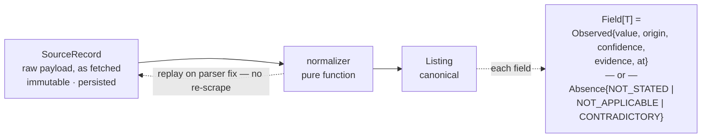

# 03 · Data model

The keystone. Almost every bug in this system will be a provenance or a precedence bug.

## The shape



Because the raw record is kept and normalization is a pure function, a parser bug found
six weeks in is fixed by **replaying stored records**, not by re-scraping sites that may
no longer carry the listing. You cannot retrofit data you never stored.

## Types

```python
class Origin(StrEnum):
    USER         = "user"          # 120 — corrected by hand
    SOURCE_FIELD = "source_field"  # 100 — structured field on the listing
    DETAIL_PAGE  = "detail_page"   #  80 — parsed from the detail page
    TEXT_RULE    = "text_rule"     #  60 — regex over the description
    GEO_PROVIDER = "geo_provider"  #  55 — routing / places lookup
    VISION       = "vision"        #  30 — inferred from photos (R5)


class Observed[T](BaseModel):
    value:       T
    origin:      Origin
    confidence:  float                # 0..1
    evidence:    str | None           # the matched phrase, or the selector
    observed_at: datetime
    detail:      dict[str, str] = {}  # provider, model, prompt_version


class Absence(StrEnum):
    NOT_STATED     = "not_stated"      # source was silent
    NOT_APPLICABLE = "not_applicable"  # a house has no floor number
    CONTRADICTORY  = "contradictory"   # sources disagree, unresolved


Field = Observed[T] | Absence


class Money(BaseModel):  amount: Decimal; currency: str; period: Period
class Area(BaseModel):   value: float;    unit: AreaUnit

class Place(BaseModel):
    raw_address: str | None
    structured:  StructuredAddress | None
    point:       LatLng | None
    area_key:    str | None   # validated against the citypack, NEVER an enum


class Listing(BaseModel):
    identity:   Identity          # listing_id, source, source_id, url, signature
    place:      Place
    rent:       Field[Money]
    beds:       Field[float]
    baths:      Field[float]
    area:       Field[Area]
    floor:      Field[int]
    parking:    Field[Parking]
    furnishing: Field[Furnishing]
    photos:     list[Photo]
    attributes: dict[str, Field]   # open extension — source/city specific
    raw_ref:    SourceRecordRef
    schema_version: int
```

## The four decisions baked in

1. **Store raw alongside canonical.** Adapters emit a `SourceRecord`; a normalizer
   derives the `Listing`. Enables replay. Impossible to retrofit.
2. **Money is `{amount, currency, period}`.** A bare int means CAD-per-month by
   convention and breaks the day someone runs it in Austin. Weekly quoting is normal in
   the UK and Australia.
3. **Area carries its unit.** sqft vs m². Store as given, normalize for comparison.
4. **Absence is typed.** "Source didn't say" and "doesn't apply" are different facts. A
   laneway house with no floor number is `NOT_APPLICABLE` and must not be penalised the
   way a silent listing is. The old code has ten flat `unverified_*` booleans reaching
   for this and getting it wrong — `laundry_unverified: -3` fires on units where the
   question doesn't apply.

## Precedence

```
user > source_field > detail_page > text_rule > geo_provider > vision
```

**Lower never overwrites higher.** This is what lets a cheap text rule fill a gap
without ever clobbering a value the source stated outright, and what lets the vision
enricher contribute without being able to promote a listing on its own.

## Identity

Three distinct things, conflated in the old codebase:

- **`listing_id`** — canonical. Survives cross-source merges and reposts.
- **`source` + `source_id`** — identity within one site.
- **`signature`** — content hash over address tokens and a price bucket, used for
  dedupe. Ported from `match/dedupe.py`.

A listing that vanishes and reappears next week at a lower price is a **new observation
of a known unit**, not a new row. That gives price history and repost detection for free.

## Storage schema

SQLite, WAL, forward-only numbered migrations. **No ORM** — plain SQL behind repo classes.

```sql
listing          id · first_seen · last_seen · status · schema_version
                 fields_json        -- projection of current best values

observation      id · listing_id · field · value_json · origin
                 confidence · evidence · observed_at
                 -- append-only. Current value is a projection over this.
                 -- Gives price history and repost detection for free.

source_record    id · listing_id · source · source_id · url
                 payload · content_hash · fetched_at
                 -- raw, immutable — the replay input

listing_source   listing_id · source · source_id · signature
                 -- one unit seen on N sites, deduped by signature

score            listing_id · profile_id · score · breakdown_json · computed_at
                 -- KEYED BY PROFILE FROM DAY ONE. Costs nothing now; without it
                 -- R6's two-rubric mode is a data migration.

user_state       listing_id · profile_id · shortlisted · excluded
                 contact_status · notes · viewing_at · viewing_done
                 -- never touched by archival

run              id · started_at · finished_at · sources_json
                 counts_json · notes    -- observability, per-source baselines
```

## Retention rule

> **Listing facts are replaceable. User state is not. Archival only ever touches the former.**

Order of expiry:

1. `source_record` payloads (the bulk) after N days
2. observations on listings marked gone
3. never: any listing with `user_state` showing shortlisted, contacted, or viewed

The old tracker half-implements this already — `m_`-prefixed manual rows are never
touched by sync. This makes it a rule instead of a special case.

## Liveness

Detection is inherently per-source: Craigslist returns 404/410, REW returns 200 with
"no longer available" in the body, Zumper differs again. That belongs on the `Source`.

Liveness **state** is a canonical field with provenance like any other: what we saw,
when we last checked.
