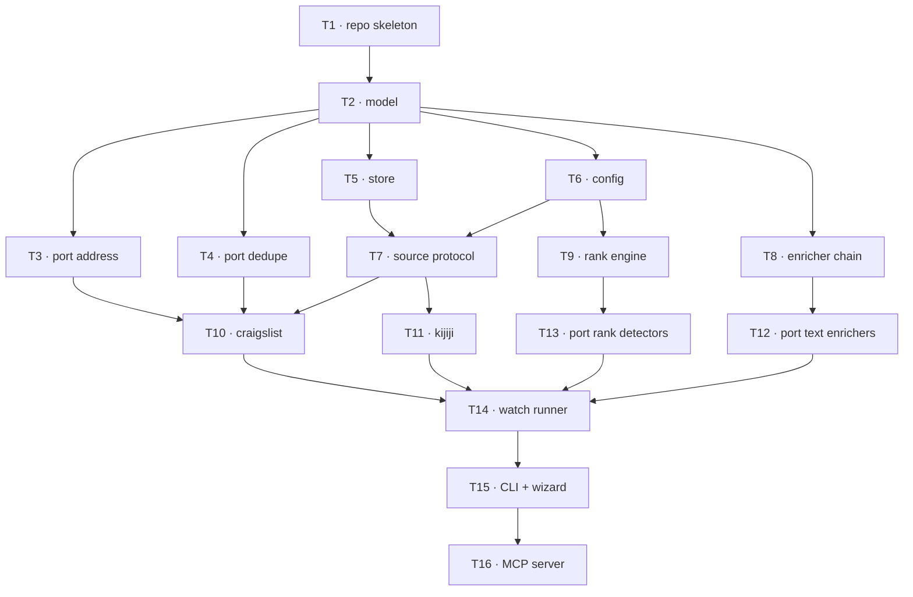

# 09 · R1 implementation tasks

Sized so each task is independently verifiable and most can run in parallel worktrees.

**Every task**: read `README.md` (agent brief) plus the docs it names. Nothing else.
**Every task ends green**: `ruff check`, `mypy --strict`, `pytest` all pass.

## Dependency graph

Parallel waves: **{T3,T4,T5,T6,T8}** · then **{T7,T9}** · then **{T10,T11,T12,T13}**.

## Model guidance

| Tasks | Suits | Why |
|---|---|---|
| T3, T4, T12, T13 | **Workhorse model** | Mechanical ports. The ported tests are an exact spec — success is objectively checkable. |
| T10, T11 | **Workhorse model** | Parser work against recorded fixtures. Verifiable offline. |
| T1, T6, T14, T16 | **Mid-tier** | Conventional structure, some judgement. |
| T2, T5, T9, T15 | **Full-capability** | T2/T5 are the keystone and expensive to get wrong. T9 is the differentiator. T15 is a UX problem, not a coding one. |

---

## T1 · Repo skeleton
**Branch** `t1-skeleton` · **Reads** `05-stack.md`
Create the repository: `pyproject.toml` (hatchling, py≥3.11, **distribution name `nostos-cli`, command `nostos`** — see D15), uv lockfile, Apache-2.0
LICENSE, README with the scraping posture, `ruff.toml`, mypy strict config, GitHub
Actions matrix on 3.11/3.12/3.13, `src/nostos/__init__.py`, empty `tests/`.
**Done when** CI is green on an empty test suite and `uv run nostos --help` exits 0.

## T2 · Canonical model
**Branch** `t2-model` · **Reads** `03-data-model.md`
`model/value.py` (Money, Area, Place, LatLng, Photo, StructuredAddress), `model/listing.py`
(Origin with precedence, Observed[T], Absence, Field, Listing), `model/identity.py`,
`model/source_record.py`.
**Done when** round-trip tests pass for every type; `Field` discriminates correctly in
both directions; a lower-precedence origin cannot overwrite a higher one (assert it);
`area_key` validates against an injected vocabulary and is **not** an enum.

## T3 · Port address normalization
**Branch** `t3-address` · **Reads** `07-porting.md`
Port `io_util/address.py` → `normalize/address.py` with `tests/test_address.py` and
`tests/test_address_posting.py` (52 tests). BC-specific token lists become parameters
supplied by the citypack, not module constants.
**Done when** all 52 ported tests pass unmodified except for import paths and the
token-list injection.

## T4 · Port dedupe
**Branch** `t4-dedupe` · **Reads** `07-porting.md`, `03-data-model.md` (Identity)
Port `match/dedupe.py` → `normalize/dedupe.py` with `tests/test_cross_source_dedup.py`
(5 tests). Signature computation moves onto `Identity`.
**Done when** the 5 ported tests pass, including the price-straddles-a-bucket case.

## T5 · Store
**Branch** `t5-store` · **Reads** `03-data-model.md`
`store/db.py` (connection, WAL, pragmas), `store/migrations/0001_initial.sql`,
`store/repo.py` (ListingRepo, ObservationRepo, ScoreRepo, RunRepo, UserStateRepo).
Migrations forward-only, numbered, applied in a transaction, version recorded.
**Done when** migration applies to an empty DB and is idempotent; an observation write
followed by a projection read returns the highest-precedence value; `score` writes are
keyed by `profile_id`.

## T6 · Config
**Branch** `t6-config` · **Reads** `04-config.md`
`config/citypack.py`, `config/profile.py`, `context.py`, plus `citypacks/vancouver.yaml`
and `profiles/balanced.yaml`.
**Done when** a citypack missing an optional adapter section loads fine; a malformed one
raises with a dotted path; `SearchContext` resolves and exposes `has_area(key)`.

## T7 · Source protocol + registry
**Branch** `t7-sources` · **Reads** `02-architecture.md` (Contracts), `04-config.md`
`sources/base.py` (Source protocol, Capabilities, Liveness), `sources/registry.py`
(resolution: enabled in profile AND citypack coverage AND credentials present).
Plus `tests/conformance/` — the suite every source must pass.
**Done when** a stub source passes conformance and the registry reports *why* a source
is off rather than silently omitting it.

## T8 · Enricher chain
**Branch** `t8-enrich` · **Reads** `02-architecture.md` (Contracts), `03-data-model.md`
`enrich/base.py` (Enricher protocol, CostModel), `enrich/chain.py` (topological order by
`requires`, skip when `provides` are already filled at equal-or-better confidence),
`enrich/budget.py` (estimate → confirm → cap).
**Done when** two stub enrichers order correctly; one is skipped when its field is
already known at higher precedence; a non-free enricher refuses to run uncapped.

## T9 · Rank engine
**Branch** `t9-rank` · **Reads** `02-architecture.md` (Scoring), `04-config.md`
`rank/rules.py` (`@rule` registry, Signal), `rank/engine.py`, `rank/explain.py`.
**Done when** score normalizes against the *enabled* weight set — a profile with half the
rules off can still reach 100 — and a breakdown renders to text a non-programmer can read.

## T10 · Craigslist source
**Branch** `t10-craigslist` · **Reads** `07-porting.md`, `02-architecture.md`
`sources/craigslist.py` with `discover`, `fetch_detail`, `check_liveness`, `to_listing`.
Port `parse_cl_rss` and `cl_posted_iso`. Record fixtures into `tests/fixtures/craigslist/`.
**Done when** conformance passes, `to_listing` is pure and tested offline, and the
case-sensitive base62 ID test survives.

## T11 · Kijiji source
**Branch** `t11-kijiji` · **Reads** `07-porting.md`, `02-architecture.md`
Same contract via JSON-LD `ItemList` using extruct. Fixtures recorded.
**Done when** conformance passes with a structurally different discovery mechanism —
this is what proves the protocol isn't Craigslist-shaped.

## T12 · Port text enrichers
**Branch** `t12-text` · **Reads** `07-porting.md`, `03-data-model.md`
Port `recover_missing_attributes` and the text detectors from `match/criteria.py` and the
detector halves of `track/score.py` → `enrich/text.py`. Each emits `Observed` with
`origin=TEXT_RULE` and the matched phrase as evidence.
**Done when** "basement storage" does not trip the basement filter, marketing copy does
not set the neighbourhood, and content never overwrites a structured value.

## T13 · Port rank detectors
**Branch** `t13-detectors` · **Reads** `07-porting.md`, `02-architecture.md` (Scoring)
Port laundry-with-negation, floor-from-unit-number, walk-score parsing, den/solarium,
walkable/sparse phrases → `@rule` detectors. **Functions come across; every number stays
behind in the profile.**
**Done when** each detector returns a Signal with evidence and no detector contains a
magnitude constant.

## T14 · Watch runner
**Branch** `t14-watch` · **Reads** `02-architecture.md` (Cross-cutting)
`watch/runner.py` (concurrent per source, one store transaction per stage),
`watch/notify.py` (apprise), `watch/health.py` (per-source baselines, `load_bearing`).
**Done when** a source failing does not fail the run; a `load_bearing` source at zero
alerts; a `run` row records per-source counts.

## T15 · CLI and wizard
**Branch** `t15-cli` · **Reads** `04-config.md` (The wizard), `01-vision.md`
`cli.py` (`init`, `watch`, `rank`, `list`, `explain`) and `config/wizard.py` — plain
questions in, weights out.
**Done when** a person who has not read any of these docs can go from `pip install` to a
ranked result in one sitting. **This is R1's ship gate — treat it as the feature it is.**

## T16 · MCP server
**Branch** `t16-mcp` · **Reads** `02-architecture.md` (Surfaces)
`mcp/server.py` — typed tools wrapping CLI commands. No logic of its own.
**Done when** every tool maps to a CLI command and the server exposes no capability the
CLI lacks.

---

## The gate that matters

Beyond each task's DoD, R1 is not done until this test passes:

> Two different profiles over one fixture set produce meaningfully different orders,
> and the top result under each is explicable from its breakdown alone.

That is the thesis, asserted.
